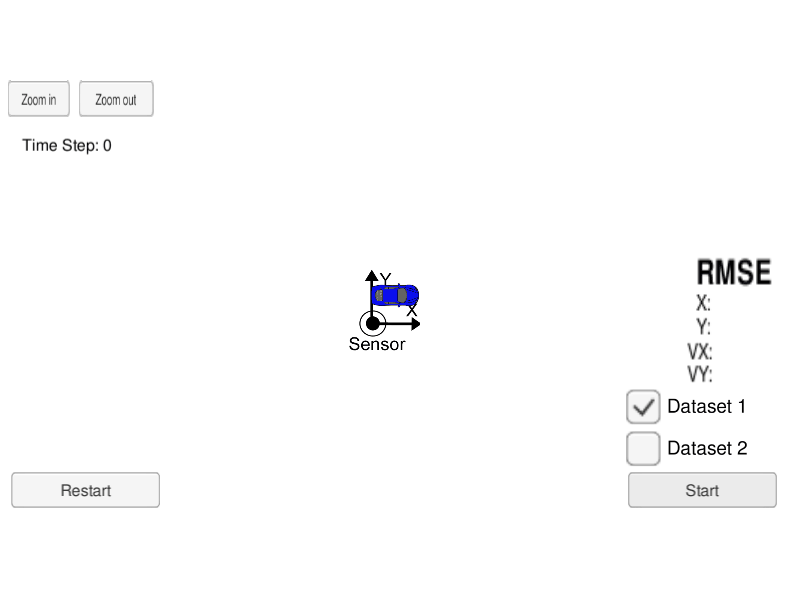

# Project: Extended Kalman Filter

This project has been prepared by Andre Strobel.

The goal of this project is to program an extended Kalman filter in *C/C++* to demonstrate [sensor fusion](https://en.wikipedia.org/wiki/Sensor_fusion). In this example the extended Kalman filter tracks a moving object using [LIDAR](https://en.wikipedia.org/wiki/Lidar) and [RADAR](https://en.wikipedia.org/wiki/Radar) measurements.

The following table shows an overview of the most important files:

| File                                          | Description                                                    |
|-----------------------------------------------|----------------------------------------------------------------|
| README.md                                     | This file                                                      |
| install-ubuntu.sh                             | Script to install uWebSocketIO                                 |
| data/obj_pose-laser-radar-synthetic-input.txt | Example input data file                                        |
| build/ExtendedKF                              | Compiled executable to run the extended Kalman filter          |
| build/out.txt                                 | Debugging output of the extended Kalman filter                 |
| src/main.cpp                                  | Source code of main function of extended Kalman filter project |
| src/FusionEKF.{h, cpp}                        | Source code of sensor fusion object                            |
| src/kalman_filter.{h, cpp}                    | Source code of extended Kalman filter implementation           |
| src/tools.{h, cpp}                            | Source code of tool object used by extended Kalman filter      |

---

## Content

1. Tool chain setup
    1. Gcc, Cmake, Make and uWebSocketIO
    1. Udacity Simulator
1. Input data definition
    1. Input data structure
    1. Input data files
1. Extended Kalman filter implementation
    1. Primary equations
    1. Implementation in C/C++
1. Execution with given input data
    1. Commands to start the simulation
    1. Simulation results
1. Discussion

[//]: # (Image References)

[image1]: ./180921_StAn_EKF_Dataset_1.png
[image2]: ./180921_StAn_EKF_Dataset_2.png

---

## 1. Tool chain setup

### 1. Gcc, Cmake, Make and uWebSocketIO

This project requires the following programs:

* gcc/g++ >= 5.4
  - Linux: gcc / g++ is installed by default on most Linux distros
  - Mac: same deal as make - [install Xcode command line tools](https://developer.apple.com/xcode/features/)
  - Windows: recommend using [MinGW](http://www.mingw.org/)
  
* cmake >= 3.5
  - All OSes: [click here for installation instructions](https://cmake.org/install/)
  
* make >= 4.1 (Linux, Mac), 3.81 (Windows)
  - Linux: make is installed by default on most Linux distros
  - Mac: [install Xcode command line tools to get make](https://developer.apple.com/xcode/features/)
  - Windows: [Click here for installation instructions](http://gnuwin32.sourceforge.net/packages/make.htm)
  
* [uWebSocketIO](https://github.com/uWebSockets/uWebSockets)
  - Works with Linux and Mac systems
  - Windows: Use Docker, VMware or even [Windows 10 Bash on Ubuntu](https://www.howtogeek.com/249966/how-to-install-and-use-the-linux-bash-shell-on-windows-10/) (although I wasn't able to get it working with the latest Ubuntu app in Windows 10)

### 2. Udacity Simulator

The extended Kalman filter program connects to the [Udacity Simulator](https://github.com/udacity/self-driving-car-sim/releases) via [uWebSocketIO](https://github.com/uWebSockets/uWebSockets). The simulator is available for Linux, Mac and Windows.

## 2. Input data definition

### 1. Input data structure

The input data is either a LIDAR or RADAR measurement.

LIDAR measurements are structures the following way:

| Variable              | Value or Description                  |
|-----------------------|---------------------------------------|
| `sensor_type`         | L                                     |
| `x_measured`          | measured x position of object         |
| `y_measured`          | measured y position of object         |
| `timestamp`           | time in nano seconds since 01/01/1970 |
| `x_groundtruth`       | actual x position of object           |
| `y_groundtruth`       | actual y position of object           |
| `vx_groundtruth`      | actual x velocity of object           |
| `vy_groundtruth`      | actual y velocity of object           |
| `yaw_groundtruth`     | actual yaw angle of object (not used) |
| `yawrate_groundtruth` | actual yaw rate of object (not used)  |

RADAR measurements are structures the following way:

| Variable              | Value or Description                  |
|-----------------------|---------------------------------------|
| `sensor_type`         | R                                     |
| `rho_measured`        | distance to object                    |
| `phi_measured`        | angle to object                       |
| `rhodot_measured`     | change of distance to object          |
| `timestamp`           | time in nano seconds since 01/01/1970 |
| `x_groundtruth`       | actual x position of object           |
| `y_groundtruth`       | actual y position of object           |
| `vx_groundtruth`      | actual x velocity of object           |
| `vy_groundtruth`      | actual y velocity of object           |
| `yaw_groundtruth`     | actual yaw angle of object (not used) |
| `yawrate_groundtruth` | actual yaw rate of object (not used)  |

### 2. Input data files

The input data file contains LIDAR or RADAR measurements in rows. The variables inside a row are separated by tabulators. An example file can be found in [./data/obj_pose-laser-radar-synthetic-input.txt](./data/obj_pose-laser-radar-synthetic-input.txt).

Additional input data files can be generated with the [utilities repo](https://github.com/udacity/CarND-Mercedes-SF-Utilities) which contains [Matlab](https://www.mathworks.com/products/matlab.html) scripts that can generate this data.

## 3. Extended Kalman filter implementation

### 1. Primary equations

In this project the prediction steps of the standard Kalman filter for LIDAR measurements and the extended Kalman filter for RADAR measurements are identical, because we assume a linear motion model.

```C
// predict state - linear model, i.e. same for LIDAR and RADAR (no need to use Jacobian of F)
x_ = F_ * x_;

// predict noise
Ft = F_.transpose();
P_ = (F_ * P_ * Ft) + Q_;
```

The update step of the standard Kalman filter for LIDAR measurements is shown below.

```C
// calculate y for LIDAR measurement (linear model, standard KALMAN filter)
y_laser = z - H_ * x_;

// calculate identity matrix
I = MatrixXd::Identity(NUM_STATES, NUM_STATES);

// calculate matrices
Ht = H_.transpose();
S = H_ * P_ * Ht + R_;
Si = S.inverse();
K =  P_ * Ht * Si;

// new state and noise
x_ = x_ + (K * y);
P_ = (I - K * H_) * P_;
```

In the update step of the extended Kalman filter for RADAR measurements the measurement post fit `y` is calculated via the measurement function `hx` as shown below.

```C
// calculate polar state variables
rho = sqrt((px * px) + (py * py));
if (fabs(rho) < ZERO_DETECTION) {
    rho = ((rho > 0) - (rho < 0)) * ZERO_DETECTION; // avoid value close to zero - retain sign
}
phi = atan2(py, px);
rho_dot = ((px * vx) + (py * vy)) / rho;

// calculate h
hx(0) = rho;
hx(1) = phi;
hx(2) = rho_dot;

// calculate y (non-linear model, extended KALMAN filter)
y_radar = z - hx;
while (y_radar(1) > PI || y_radar(1) < -PI ) {
    if (y_radar(1) > PI) {
        y_radar(1) -= PI;
    } else {
        y_radar(1) += PI;
    }
}
```

All the other extended Kalman filter matrix calculations are the same as for the standard Kalman filter. The only exception is that the measurement matrix `H_` is replaced by the Jacobian `Hj`.

```C
Hj = MatrixXd(NUM_RADAR_MEASUREMENTS, NUM_STATES);
Hj << 1, 1, 0, 0,
      1, 1, 0, 0,
      1, 1, 1, 1;

...

// pre-compute a set of terms to avoid repeated calculation
c1 = ((px * px) + (py * py));
if (fabs(c1) < ZERO_DETECTION) {
    c1 = ((c1 > 0) - (c1 < 0)) * ZERO_DETECTION; // avoid value close to zero - retain sign
}
c2 = sqrt(c1);
c3 = (c1 * c2);

// compute the Jacobian matrix
Hj(0, 0) = (px / c2);
Hj(0, 1) = (py / c2);
Hj(1, 0) = -(py / c1);
Hj(1, 1) = (px / c1);
Hj(2, 0) = ((py * ((vx * py) - (vy * px))) / c3);
Hj(2, 1) = ((px * ((px * vy) - (py * vx))) / c3);
Hj(2, 2) = (px / c2);
Hj(2, 3) = (py / c2);
```

### 2. Implementation in C/C++

The `main.cpp` function connects to the simulator via [uWebSocketIO](https://github.com/uWebSockets/uWebSockets) and receives either LIDAR or RADAR measurements as decribed above.

An object `fusionEKF` of the `FusionEKF` class (defined in `FusionEKF.h` and `FusionEKF.cpp`) is used to process the input data via the `FusionEKF::ProcessMeasurement()` method. In the constructor of `FusionEKF` all matrix variables and an object `ekf_` of the class `KalmanFilter` (defined in `kalman_filter.h` and `kalman_filter.cpp`) are initialized. The first measurement is used in the `FusionEKF::ProcessMeasurement()` method to initialize the state of the Kalman filter object `ekf_`. The `KalmanFilter` class contains the methods for prediction `KalmanFilter::Predict()` as well as LIDAR update `KalmanFilter::Update()` and RADAR update `KalmanFilter::UpdateEKF()`. These methods are called by the `FusionEKF::ProcessMeasurement()` method in the required sequence and with the correct parameters.

After a measurement has been processed using the `fusionEKF` object, the `main.cpp` function receives the new state prediction and calculates the [Root Mean Square Error (RMSE)](https://en.wikipedia.org/wiki/Root-mean-square_deviation) of estimation versus provided ground truth. All results are then sent back to the simulator.

The `Tools` class (defined in `tools.h` and `tools.cpp`) implements the RMSE calculation with the `Tools::CalculateRMSE()` method and the calculation of the Jacobian with the `Tools::CalculateJacobian()` method.

## 4. Execution with given input data

### 1. Commands to start the simulation

The program is compiled and executed within the `build` folder using the following commands.

1. cd build
2. cmake ..
3. make
4. ./ExtendedKF

Once the program is running and listening on port 4567 the simulator can be started.

### 2. Simulation results

In the simulator the blue dots are LIDAR measurements and the red dots are RADAR measurements. The sensor fusion results are shown as green dots and are clearly closer to the ground truth values than the individual measurements for LIDAR or RADAR (see animation and final still image below).



![alt text][image1]

The debugging output of this example can be found in [./build/out.txt](./build/out.txt).

The final RMSE values are `[0.0973, 0.0855, 0.4513, 0.4399]` and therefore well below the maximum allowed error values `[0.11, 0.11, 0.52, 0.52]`.

## 5. Discussion

The main challenge of this project is the setup of a working tool chain when you use a Windows computer.

Also, the provided templates used a mixture of different programming styles and a lot of inline variable definitions. For consistency and easier debugging I did some minor clean up.

As `C/C++` requires to compile the code prior to execution, I added a lot of debugging messages that are routed via the standard output `cout` to the file [./build/out.txt](./build/out.txt). In lack of an [Integrated Development Environment (IDE)](https://en.wikipedia.org/wiki/Integrated_development_environment) this helped a lot to quickly get a working program. It will also help if somebody wants to make additional changes to this code in the future. The debugging can be turned off by setting all `bDISPLAY` variables to `false`.